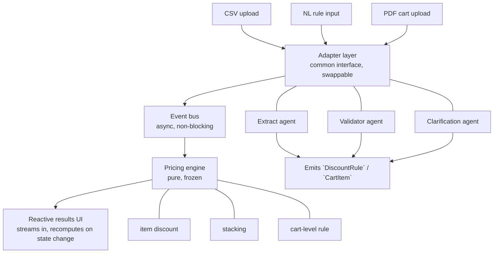

# Opptra Discount Engine

Live demo: https://discount-engine-chi.vercel.app/

A storefront-style discount engine built for the Opptra FDE assignment. The app lets shoppers browse products, add items to a cart, and see pricing update live as brand, platform, stackable, and cart-wide offers are applied. It also includes merchant tools for importing rules and carts from CSV or PDF, plus a natural-language rule studio.

## What this project does

- Shows active offers in a storefront UI.
- Calculates item-level discounts in real time.
- Applies the best non-stackable rule, then layers stackable rules.
- Applies cart-wide offers when the cart crosses a threshold.
- Explains each price result in plain language.
- Supports CSV import for rules and carts.
- Supports PDF cart extraction.
- Supports natural-language rule entry through the Rule Studio.

## Tech Stack

- React 18
- Vite
- TypeScript and JavaScript
- Vitest
- PapaParse for CSV parsing
- PDF.js / pdfjs-dist for PDF extraction
- Zod for validation
- Vercel for deployment

## Project Structure

```text
discount-engine/
  src/
    App.jsx
    data/
    engine/
    state/
    ui/
    components/
    adapters/
    lib/
  sample-data/
  vercel.json
  package.json
  vite.config.js
```

## Core Approach

The app uses a layered architecture with swappable adapters at the top, a non-blocking event bus in the middle, and a pure pricing engine at the core.

1. CSV upload, natural-language rule input, and PDF cart upload all enter through adapter layers.
2. Adapters normalize input into common `DiscountRule` and `CartItem` shapes.
3. The event bus emits changes without blocking the UI.
4. `cartStore` recomputes pricing by running the pure discount engine.
5. The UI reacts to store updates and renders active offers, totals, and human-readable explanations.

### Pricing rules

- If multiple non-stackable rules match an item, the rule with the largest rupee saving wins.
- Stackable rules are applied on top of the winning non-stackable rule.
- If no item rules match, the item keeps its base price.
- Cart offers apply only when the cart total reaches the configured threshold.

## Architecture Flow



## Main Screens

- Hero section with navigation to the shop and Rule Studio.
- Active offers strip.
- Product grid with live price updates.
- Cart drawer with totals and savings.
- Rule Studio for natural-language rules, CSV import, PDF import, and active rules table.
- Pricing breakdown panel with item-by-item explanations.

## Sample Data

The app seeds sample rules and a sample cart on first load so the demo works immediately.

- `sample-data/rules.csv`
- `sample-data/cart.csv`

You can replace them using the Rule Studio import controls.

## Local Setup

### 1. Clone and open the app folder

```bash
cd discount-engine
```

### 2. Install dependencies

```bash
npm install
```

### 3. Add environment variables

Create a `.env` file in `discount-engine/` with your Gemini API key if you want to use the natural-language rule flow.

```bash
VITE_GEMINI_API_KEY=your_api_key_here
```

### 4. Start the dev server

```bash
npm run dev
```

### 5. Open the app

Open http://localhost:5173

## Build

```bash
npm run build
```

This creates the production output in `dist/`.

## Deployment

The app is already set up for Vercel.

- Project root: `discount-engine`
- Build command: `npm run build`
- Output directory: `dist`

Live URL:
https://discount-engine-chi.vercel.app/

## How to Use

1. Open the storefront.
2. Add products to the cart.
3. Watch item prices update as offers apply.
4. Check the pricing breakdown for rule-by-rule explanations.
5. Use Rule Studio to load CSV or PDF cart/rule files.
6. Add or edit a natural-language rule and reprice the cart.

## Notes

- The storefront is intentionally seeded with a small product set for a cleaner demo.
- The cart still uses canonical sample items so the discount breakdown remains easy to verify.
- Do not commit real API keys. Keep them in `.env` locally and set them as environment variables in your deployment platform.

## Useful Commands

```bash
npm install
npm run dev
npm run build
npm test
```

## Acceptance Highlights

- Live pricing for catalog items.
- Best-rule selection for non-stackable offers.
- Stackable offer support.
- Cart threshold discount support.
- CSV and PDF import support.
- Natural-language offer input.
- User-friendly breakdown of every applied rule.

## License

This project was built for the Opptra FDE assignment.
