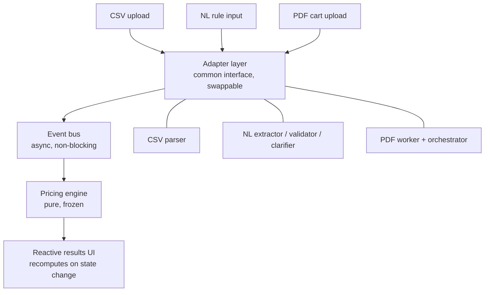
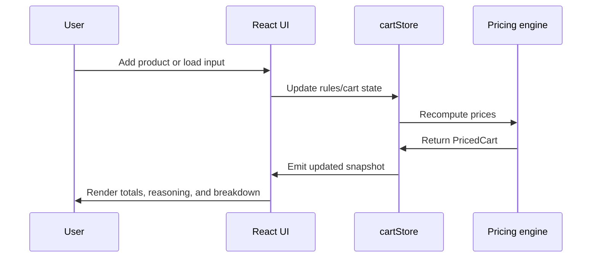

# Architecture

## Core Idea

The central design choice in this project is to keep the discount engine pure and frozen, and treat every new input surface as an adapter that produces engine-shaped data.

That means:

- the pricing engine never knows whether data came from CSV, PDF, or plain English
- adapters translate input into `DiscountRule` and `CartItem`
- the event bus moves changes through the app without making the UI or parser own pricing logic
- the UI subscribes to store updates and renders the latest snapshot

This directly satisfies the brief's key constraint: do not rebuild the engine to accommodate new inputs.

## System Overview

## Main Decisions

### 1. Keep pricing pure

The pricing layer lives in `src/engine/applyCartOffer.ts` and only accepts typed inputs:

- `DiscountRule[]`
- `CartItem[]`

It returns a `PricedCart` and does not perform file I/O, UI rendering, or parsing.

Why this matters:

- the engine is easy to test
- the behavior is deterministic
- new input methods do not require engine rewrites
- cart-level logic stays separate from item-level discounting

The engine is split into two stages:

- item-level discount calculation
- cart-level offer application

That split keeps the rules clear and makes it easy to explain why a final price was chosen.

### 2. Put all input conversions behind adapters

There are three input paths in the app:

- CSV rule import
- CSV cart import
- PDF cart extraction
- natural-language rule entry

Each path converts input into the same internal shapes used by the pricing engine.

This is why the repository has dedicated adapter folders:

- `src/adapters/nl`
- `src/adapters/pdf`

The adapters are intentionally responsible for parsing, validation, and clarification. They do not calculate discounts.

### 3. Use a non-blocking event bus

The app uses a small event bus in `src/state/eventBus.ts`.

Events include:

- `RuleAdded`
- `CartReplaced`
- `RowRejected`
- `RuleRejected`

The event bus exists so that adapters and the store can communicate without tight coupling. For example:

- the NL parser emits a rule event after validation
- the PDF orchestrator emits row rejection events for malformed rows
- the cart store listens for those events and recomputes pricing

This keeps the update flow simple and avoids direct dependencies between input handlers and UI state.

### 4. Keep the store as the state coordinator

`src/state/cartStore.ts` is the coordination layer between input, pricing, and UI.

It owns the snapshot that the UI reads:

- rules
- cart items
- issues
- pricing result
- cart offer nudge

The store recomputes pricing whenever rules or cart items change, and it also enriches the pricing result with customer-facing reasoning.

The store is not the pricing engine itself. It is the place where raw engine output is adapted into the shape the UI needs.

### 5. Make the UI reactive, not procedural

`src/App.jsx` subscribes to the store with `useSyncExternalStore`.

That means the UI always renders the current snapshot, instead of manually orchestrating rerenders after each action.

The screen is divided into these user-visible regions:

- active offers
- storefront catalog
- cart panel
- rule studio
- pricing breakdown
- footer

The UI does not calculate discounts. It only displays the latest state from the store.

## Input Pipelines

### CSV Import

CSV uploads are handled through the existing parser utilities and then passed into the store.

Flow:

1. user uploads `rules.csv` or `cart.csv`
2. parser converts the CSV text into typed rows
3. the store receives rules or cart items
4. pricing recomputes
5. the UI updates immediately

### Natural-Language Rule Input

The natural-language path is implemented in `src/adapters/nl`.

Actual behavior:

- `NLRuleParser.jsx` accepts a plain-English sentence
- `extractRuleAgent.ts` tries Gemini-backed extraction if an API key is available
- if Gemini is unavailable, the app falls back to the deterministic heuristic parser
- `validateRuleAgent.ts` checks whether the extracted result is a valid discount rule
- `clarifyRuleAgent.ts` converts validation failures into a human-readable follow-up question

Important implementation note:

- this project does use Gemini when configured
- Gemini is not required for the app to work
- the fallback parser exists so the feature still works offline, in tests, and in demo environments

Why the path is structured this way:

- extraction and validation are separate concerns
- extraction can be improved or swapped without changing the pricing engine
- validation remains deterministic and business-rule-driven
- clarification makes ambiguous input actionable instead of failing silently

The reference idea of a multi-step NL flow is aligned with the implementation, but the actual code does not depend on a heavy agent framework or a `streamObject` style API. It uses a simpler, explicit implementation that is easier to run in the browser.

### PDF Cart Input

PDF cart upload is implemented with a Web Worker.

Actual flow:

1. the UI sends a file to `extractPdfCart`
2. `orchestrator.ts` starts `extractWorker.ts`
3. the worker parses the document off the main thread
4. each extracted row is normalized with `normalizeCartRows.ts`
5. invalid rows are emitted as `RowRejected`
6. valid rows are collected and the final cart is emitted as `CartReplaced`

Why this matters:

- the UI stays responsive during extraction
- malformed rows are reported without breaking the whole cart
- parsing stays isolated from pricing logic
- PDF handling can evolve independently of the engine

## Pricing Flow

The pricing sequence is intentionally one-way:

- inputs change state
- state triggers recomputation
- recomputation returns a new snapshot
- the UI renders the snapshot

This keeps the app easy to reason about and test.

## Why the Engine Is Frozen

Freezing the pricing engine was a deliberate decision.

Benefits:

- stable public contract
- testable with sample data
- no dependency on UI or input format
- no hidden side effects
- easy to add new adapters later

This is the strongest architectural answer to the brief's request for extensibility.

If a future input type is added, it should still end at the same engine-shaped data model:

- `DiscountRule`
- `CartItem`
- `PricedCart`

## Reasoning and Customer-Facing Output

The raw engine output is enhanced in the store so the UI can show readable explanations such as:

- why one rule beat another
- how stackable rules were applied
- when no offer matched
- when a cart offer triggered

That reasoning is not part of the core engine contract. It is presentation-friendly enrichment added by the store layer.

This separation keeps the engine simple while still producing useful output for users.

## Sample Data Strategy

The app seeds sample rules and a small sample cart on first load.

Why:

- the demo works immediately
- the pricing breakdown is visible without extra setup
- the storefront shows meaningful discount behavior out of the box

The seeded data is a demo convenience, not a core engine dependency.

## What This Project Does Not Do

To keep the architecture clean, the project avoids a few things:

- the engine does not parse files
- the UI does not calculate discounts
- the NL path does not force Gemini to be present
- the PDF path does not block the main thread
- parsing and validation are not mixed into pricing

## Final Summary

The implementation is built around one principle: input methods can change, but the pricing contract should not.

That is why the design is split into:

- adapters for input-specific parsing
- an event bus for decoupled updates
- a pure pricing engine for deterministic business logic
- a reactive UI for display and interaction

This is the exact shape of the app today, and it is the reason new inputs can be added without rewriting the calculator.
